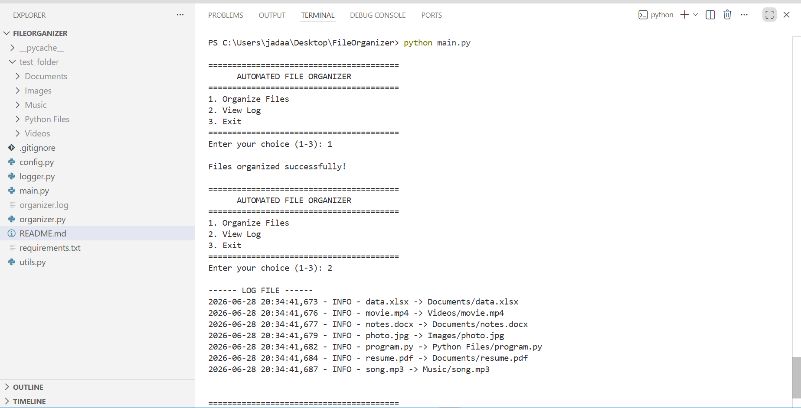
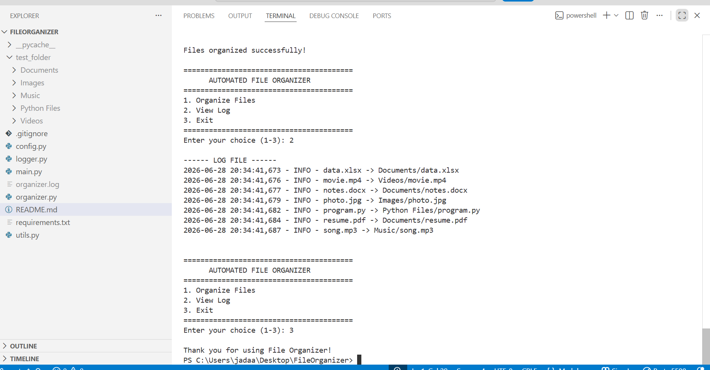

# 📁 Automated File Organizer
A Python application that automatically organizes files into folders based on their file types. The application creates folders automatically, handles duplicate file names, logs all file operations, and provides a simple menu-driven interface.

## 📌 Project Description

The Automated File Organizer is a Python application that automatically organizes files into folders based on their file extensions. It automatically creates folders, moves files into the correct folders, handles duplicate file names, and records all operations in a log file.

---

## 🚀 Features

- Organize files by file type
- Automatically create folders
- Move files to the correct folder
- Handle duplicate file names
- Skip folders while organizing
- Log all file operations
- Exception handling
- Menu-driven application

---

## 🛠 Technologies Used

- Python 3
- os
- shutil
- logging

---

## 📂 Project Structure

```text
FileOrganizer/
│
├── main.py
├── organizer.py
├── config.py
├── logger.py
├── utils.py
├── README.md
├── requirements.txt
└── .gitignore
```

---

## ▶️ How to Run

1. Open the project folder in VS Code.
2. Open the terminal.
3. Run the following command:

```bash
python main.py
```

4. Choose an option from the menu.

---

## 📋 Menu

```text
1. Organize Files
2. View Log
3. Exit
```

---

## 📸 Example Output

```text
photo.jpg -> Images/photo.jpg
resume.pdf -> Documents/resume.pdf
movie.mp4 -> Videos/movie.mp4

Files organized successfully!
```

---

## 🎯 Future Improvements

- GUI using Tkinter
- Organize files by size
- Organize files by date
- Search files
- Undo last operation
- Folder selection using file dialog
## 📸 Screenshots

### Main Menu



### Organized Files



---

## 👩‍💻 Author

**Anitha Bhavani Jada**